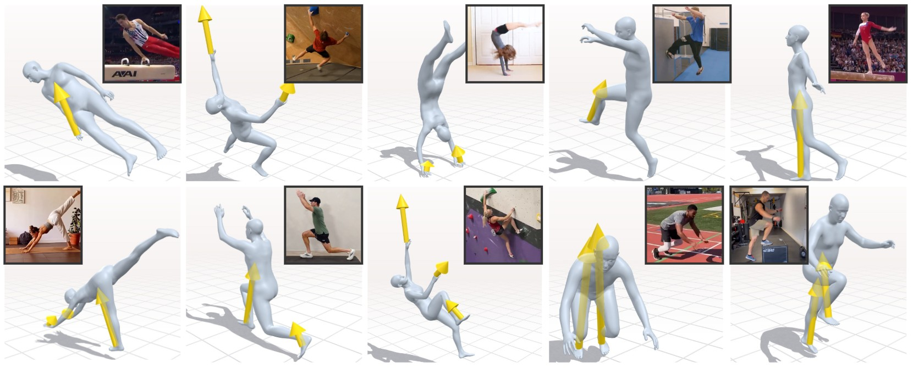

<div align="center">

# PACT

### End-to-End Learning of Human Pose, Contacts, and Forces from Video

[Rikhat Akizhanov](#)<sup>1</sup> · [Yangsong Zhang](#)<sup>1</sup> · [Nikolai Kaliazin](#)<sup>1</sup> · [Peter Wolf](#)<sup>2</sup> · [Yoshihiko Nakamura](#)<sup>1</sup> · [Pascal Fua](#)<sup>3</sup> · [Fabio Pizzati](#)<sup>1</sup> · [Ivan Laptev](#)<sup>1</sup>

<sup>1</sup> MBZUAI &nbsp;&nbsp; <sup>2</sup> ETH Zürich &nbsp;&nbsp; <sup>3</sup> EPFL

[**Project page**](https://rihat99.github.io/PACT/) &nbsp;|&nbsp; [**arXiv**](#) &nbsp;|&nbsp; *In submission, 2026*



</div>

PACT is an end-to-end model that jointly estimates human pose, environmental contacts, and contact forces from a monocular video. It augments a human reconstruction foundation model with learnable contact-force tokens and a temporal transformer that integrates visual features with world-space motion, and it is trained with physics-based supervision that ties the reconstructed motion to the predicted forces. To obtain training labels, we built an annotation pipeline that combines contact labeling with physics-based motion and force optimization on synthetic and real-world videos. We also introduce ForceWall, a real-world climbing benchmark with ground-truth contact forces measured by instrumented holds.

## Code, models and data

Coming soon. This repository will host the PACT model, pretrained weights, the annotation pipeline and the ForceWall benchmark.

## Citation

```bibtex
@article{akizhanov2026pact,
  title   = {PACT: End-to-End Learning of Human Pose, Contacts, and Forces from Video},
  author  = {Akizhanov, Rikhat and Zhang, Yangsong and Kaliazin, Nikolai and Wolf, Peter and Nakamura, Yoshihiko and Fua, Pascal and Pizzati, Fabio and Laptev, Ivan},
  journal = {arXiv preprint},
  year    = {2026}
}
```
